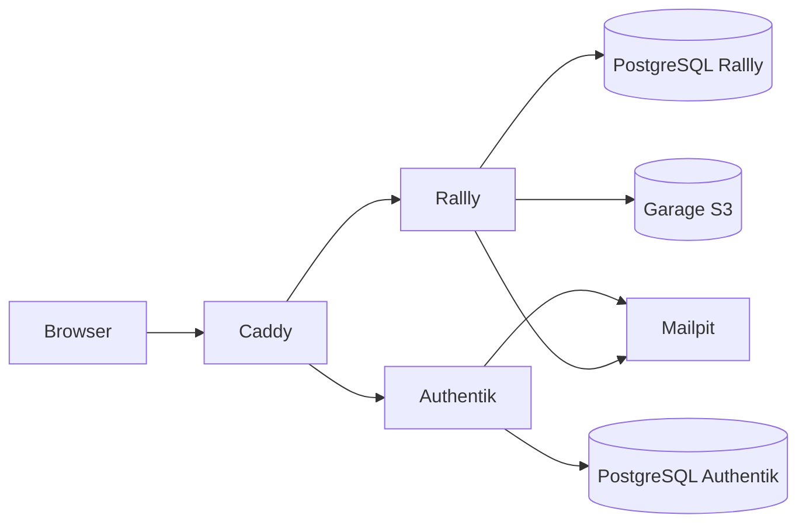

# Projet Dev avec Docker — Rallly, Authentik et proxy

Socle de travail pour le projet M2 2026–2027. La stack locale regroupe Rallly, Authentik, Caddy, PostgreSQL séparés pour chaque application, Garage (stockage S3) et Mailpit. Les seuls ports publiés sont 80/443 pour le proxy et 127.0.0.1:8025 pour consulter les emails de test. Les bases, le stockage et les applications restent sur des réseaux Docker internes.

## Démarrage local

Prérequis : Docker Engine/Desktop avec Compose v2, et environ 4 Go de mémoire disponible. Depuis la racine du dépôt :

```sh
cp .env.example .env
openssl rand -base64 48   # SECRET_PASSWORD et AUTHENTIK_SECRET_KEY (générer deux valeurs distinctes)
openssl rand -hex 24      # mots de passe PostgreSQL (deux valeurs distinctes)
openssl rand -hex 16      # S3_ACCESS_KEY_ID
openssl rand -hex 32      # S3_SECRET_ACCESS_KEY et GARAGE_RPC_SECRET
```

Remplacer chaque `CHANGE_ME` dans `.env` avec les valeurs générées. Les secrets ne doivent pas être commités. Ensuite :

```sh
docker compose up --build -d
docker compose ps
```

Ouvrir `https://authentik.localhost` pour initialiser Authentik (compte `akadmin`) et créer le certificat de l'autorité locale Caddy. Le navigateur peut afficher un avertissement jusqu'à ce que vous approuviez ce certificat racine ; il se trouve dans le volume `caddy_data` (`/data/caddy/pki/authorities/local/root.crt` dans le conteneur). Rallly charge cette autorité au démarrage pour joindre Authentik en OIDC : après avoir visité Authentik, lancer `docker compose restart rallly`. Ouvrir ensuite `https://rallly.localhost`. Les emails de test se consultent sur <http://localhost:8025>.

Arrêt : `docker compose down`. Les données persistent dans les volumes nommés. Pour repartir de zéro, supprimer explicitement les volumes avec `docker compose down -v` (efface les sondages, comptes et configurations).

## Configuration Authentik → Rallly (OIDC)

Après l'initialisation, dans Authentik, créer un fournisseur OAuth2/OIDC et une application `Rallly` (slug `rallly`). Configurer le fournisseur en client confidentiel, avec le flux d'autorisation par code, les scopes `openid`, `email` et `profile`, et l'URI de redirection exacte :

```text
https://rallly.localhost/api/auth/callback/oidc
```

Copier l'identifiant client et le secret dans `OIDC_CLIENT_ID` et `OIDC_CLIENT_SECRET` du `.env`, puis redémarrer Rallly avec `docker compose up -d --force-recreate rallly`. Le discovery est `https://authentik.localhost/application/o/rallly/.well-known/openid-configuration`; l'émetteur attendu est `https://authentik.localhost/application/o/rallly/`. Les deux noms sont également configurables pour le déploiement VM.

Créer les groupes `rallly-users` et `rallly-admins` dans **Directory → Groups**. Dans l'application Authentik `Rallly`, ajouter une liaison de groupe autorisant `rallly-users`, puis ajouter les administrateurs au groupe `rallly-admins` et à `rallly-users` s'ils ont également besoin d'utiliser Rallly. Vérifier avec un compte membre et un compte non membre : le premier termine le flux OIDC, le second est refusé par Authentik. Les sondages Rallly restent gouvernés par les rôles de l'application ; les groupes Authentik contrôlent l'accès au fournisseur OIDC.

### Invitation d'un utilisateur externe

Dans **Directory → Invitations**, utiliser le menu de création pour lancer l'assistant avec un nouveau flux d'inscription et un stage Invitation obligatoire. Régler l'invitation en usage unique et avec une durée d'expiration courte. Dans le flux, configurer le stage **User Write** pour ajouter les comptes inscrits au groupe `rallly-users`. Copier le lien d'invitation et le transmettre au participant (ou utiliser « Send via Email » après configuration d'un SMTP réel). Démontrer l'inscription avec ce lien, puis l'accès à Rallly via OIDC. Mailpit reçoit les emails localement ; les messages sont visibles sur le port 8025 et ne sont pas envoyés à de vraies adresses.

Authentik n'est pas préconfiguré automatiquement : l'application, le fournisseur, les groupes, liaisons et flux sont créés dans son interface d'administration. Les captures et comptes réels de démo seront ajoutés après cette configuration.

## Architecture



La stack locale et VM utilise le même Compose et les mêmes images. Pour la VM Énov, créer la VM selon la documentation publique du campus, puis installer Docker/Compose et ouvrir les ports 80/443 sur le réseau demandé. Faire pointer deux noms DNS (`RALLLY_DOMAIN` et `AUTHENTIK_DOMAIN`) vers la VM, modifier ces valeurs dans le `.env`, configurer `ACME_EMAIL` avec une vraie adresse et `NEXT_PUBLIC_BASE_URL=https://<domaine-rallly>`, puis déployer avec `docker compose up --build -d`. Caddy obtiendra les certificats publics si les noms DNS sont résolus vers la VM et si les ports 80/443 sont accessibles. Mettre à jour l'URI de redirection OIDC avec le domaine réel. Le port Mailpit reste lié à localhost ; utiliser un tunnel SSH ponctuel pour lire les emails de test sur la VM.

Accès VM, DNS, pare-feu et compte de démonstration formateur restent à renseigner par le groupe ; aucun accès campus n'est fourni dans le dépôt.

## CI/CD et sécurité

GitHub Actions vérifie la syntaxe Compose et construit l'image Caddy personnalisée à chaque push sur `main` et pull request. Le déploiement VM reste manuel à ce stade ; l'image construite n'est pas publiée. Les secrets sont dans `.env` ignoré par Git. Les ports des bases ne sont pas publiés, chaque base possède son réseau interne, Caddy masque les services applicatifs et les conteneurs applicatifs utilisent `no-new-privileges`. Authentik n'a pas accès au socket Docker. Les images officielles de base ne sont pas reconstruites ici ; prévoir un scan d'images avant une exposition durable.

## Features Rallly

Le sujet attribue deux features du catalogue par groupe et demande une feature libre. L'attribution et l'idée du groupe ne sont pas incluses dans les éléments fournis. À compléter dès réception :

| Type | Feature | Démonstration |
|---|---|---|
| Catalogue 1 | À préciser par le formateur | À documenter |
| Catalogue 2 | À préciser par le formateur | À documenter |
| Libre | À proposer par le groupe | À documenter |

Chaque feature devra être développée sur le fork Rallly du groupe, avec son périmètre et ses captures documentés ici. Le bonus de contribution upstream n'est pas inclus dans ce travail.

## Soutenance — éléments à finaliser

- [ ] Démo locale et accès VM fonctionnels, URL et comptes de test communiqués au formateur.
- [ ] Parcours OIDC, refus par groupe, invitation externe et email démontrés.
- [ ] Pipeline verte sur la branche principale et preuve jointe.
- [ ] Features attribuées implémentées, captures ajoutées, feature libre démontrée.
- [ ] Support de présentation préparé ; chaque membre intervient.

## Références

- [Authentik — Compose](https://docs.goauthentik.io/install-config/install/docker-compose/)
- [Authentik — fournisseur OAuth2/OIDC](https://docs.goauthentik.io/add-secure-apps/providers/oauth2/)
- [Authentik — invitations](https://docs.goauthentik.io/users-sources/user/invitations/)
- [Rallly — déploiement self-hosted](https://github.com/lukevella/rallly-selfhosted)
- [Documentation VM Énov](https://github.com/Enov-Salle-Serveur/Documentation_Public/blob/main/README.md)
